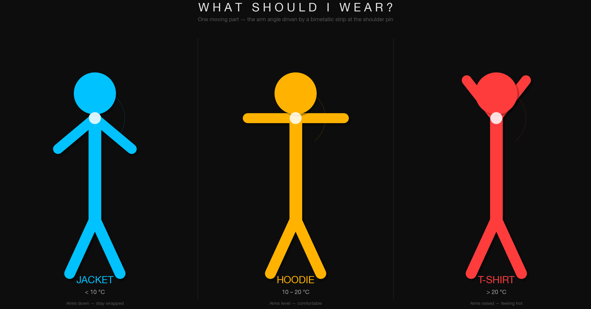
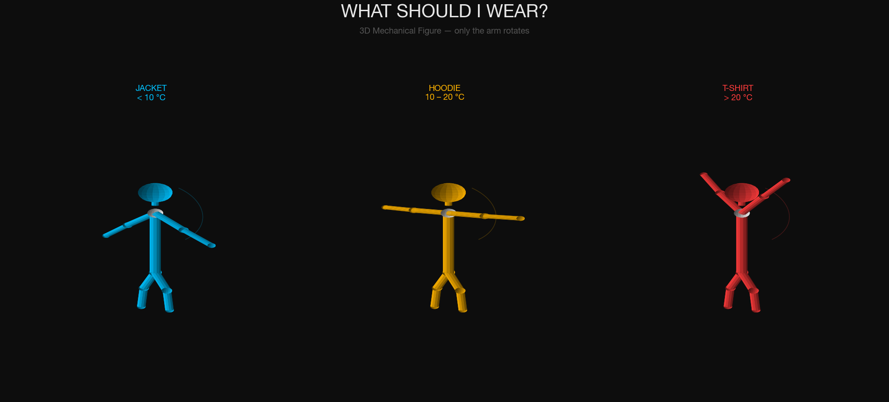
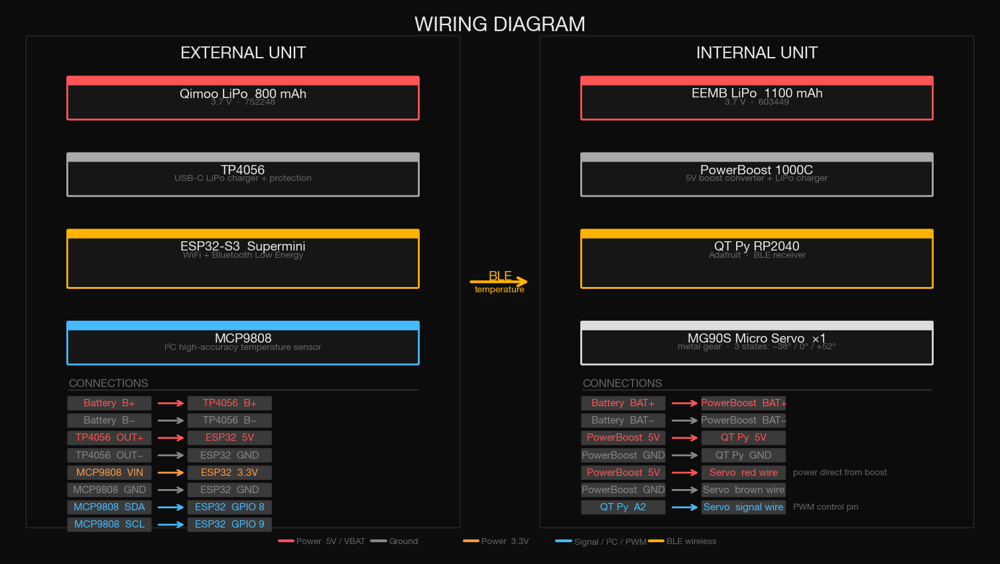

# temperature_figure

I started this project from a simple observation — I kept checking the weather app before leaving the house but still ended up under or overdressed. The number on the screen never really translated into what to actually wear. There is a gap between data and decision, and I wanted to close it with something you can just glance at.

The idea is a small 3D-printed figure that sits on a shelf indoors. Its arm moves to one of three positions based on the current outdoor temperature — pointing down for a jacket, level for a hoodie, raised for a t-shirt. No screen, no notification, just a posture.

**Week 1** was spent modelling the overall shape. I looked at how objects like pine cones open and close in response to their environment and used that as a starting point for something that reacts physically rather than digitally.

**Week 2** I focused on the figure itself — proportions, how the arm connects, and how the three states would read clearly at a glance from across a room.

**Week 3** I worked out the twisting mechanism through the 3D model. The arm rotation is driven by a MG90S micro servo inside the body, controlled by a QT Py RP2040 that receives temperature data wirelessly from an ESP32-S3 placed outdoors via Bluetooth Low Energy. The two units are fully self-contained and battery powered — no wires between them, nothing to plug in daily.

This week the goal is to 3D print the parts, assemble everything, and get it running.

---

## What is the project

The system is made of two physical objects:

1x indoor figure — sits on a shelf, displays the outfit state by moving its arm
1x external thermostat — placed outside, reads the temperature and sends it wirelessly

---

## How the code works

The ESP32-S3 outdoors reads the temperature from the MCP9808 sensor over I²C every few seconds and broadcasts the value via Bluetooth Low Energy. The QT Py RP2040 indoors listens for that broadcast, receives the temperature value, and maps it to one of three servo angles.

Below 12°C the arm moves to the jacket position. Between 12 and 22°C it holds at hoodie. Above 22°C it raises to t-shirt. The servo holds that position until the next reading changes it.

---

## How the body works

The figure is printed in two halves. The servo sits inside the torso and connects directly to the arm via a short shaft. The arm pivots on a pin hinge at the shoulder. The external unit is a separate enclosure that houses the ESP32-S3, sensor, battery, and charger — it mounts outside a window or on a balcony.

---

## Figure states

---

## Components purchased

Outdoor unit
Teyleten ESP32-S3 Supermini
MCP9808 I²C temperature sensor
Qimoo 800mAh LiPo battery
HiLetgo TP4056 USB-C charger module

Indoor unit
Adafruit QT Py RP2040
MG90S metal gear micro servo
EEMB 1100mAh LiPo battery
Adafruit PowerBoost 1000C

---

🔗 [github.com/dtafuri-lab/temperature_figure](https://github.com/dtafuri-lab/temperature_figure)
